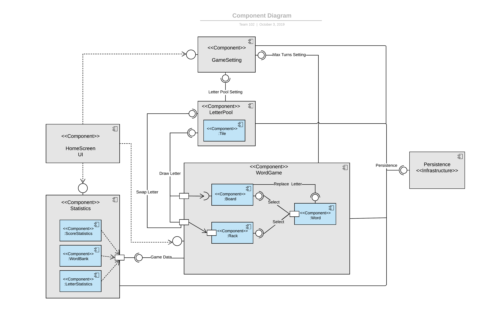
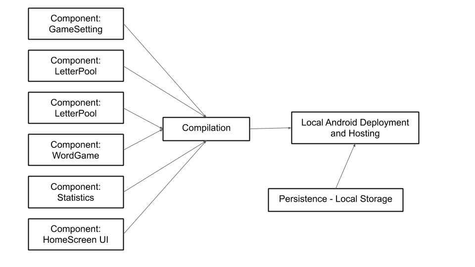
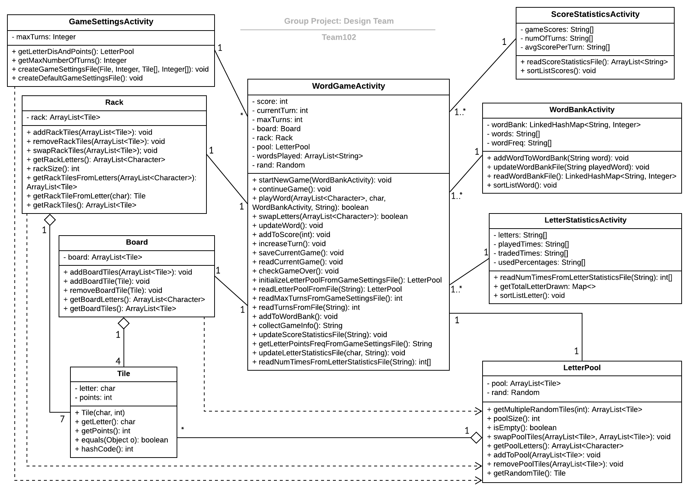
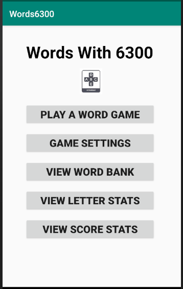
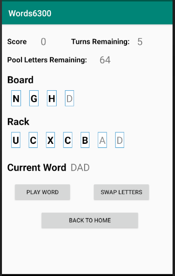
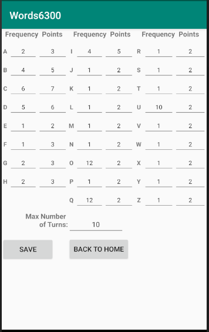
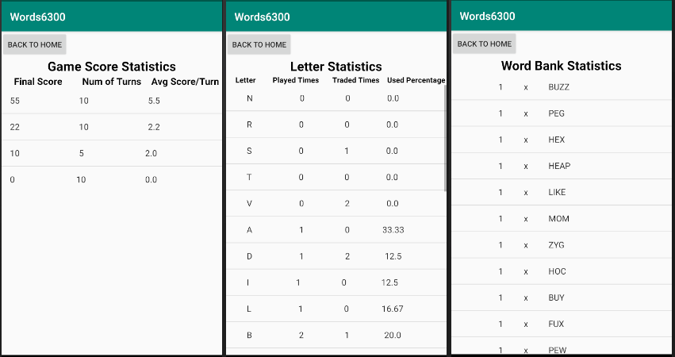
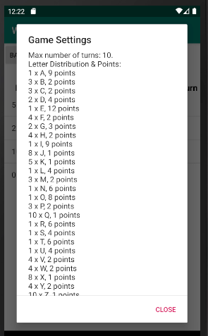

# Design Document

**Author**: Team 102

**Version**: V1018.2

## 1 Design Considerations

### 1.1 Assumptions

* This Word Game app design has following assumptions:
	- The app is designed for using at Android mobile devices.
	- The app is designed for a single user to play scrabble.
	- The app assumes that all player entered words are spelled correctly.
	- The app doesn’t need internet connection.   

### 1.2 Constraints

* The device should have enough memory to store the game data for game statistics analysis.
* The device’s OS system should have Persistence infrastructures so that the app can track game progress.

### 1.3 System Environment

*   Hardware requirement: Mobile devices with touch screen and reasonable screen size. 
*   Software requirement: The OS system should support Android 6.0 (Marshmallow).

## 2 Architectural Design

### 2.1 Component Diagram

* From HomeScreen UI, a player can access GameSetting, WordGame and Statistics components.
* GameSetting component has two provided interfaces for WordGame and LetterPool components to access game settings.
* LetterPool component has an internal Tile component, which holds letters and their corresponding points. LetterPool component has a provided interface for WordGame to draw letters (tiles) from LetterPool. It also has a required interface that accepts letters (tiles) that were swapped back from WordGame’s Rack component.
* WordGame component itself has three internal components: Rack, Board and Word component. Word component ‘select’ letters from the Board and Rack component to make a word. The letter on the Board component can be replaced by a letter from the Word component through the 'Replace Letter' interface. WordGame component has two ports that can be used to draw or swap letters from LetterPool component. In addition, WordGame has a provided interface for Statistics component to collect game data.
* Statistics component contains three internal components: ScoreStatistics, WordBank, LetterStatistics component. All these three components use a port with a required interface to get data from the WordGame component. 
* Persistence infrastructure has a ‘persistence’ interface to connect with GameSetting, LetterPoll, WordGame and Statistics components.  

### 2.2 Deployment Diagram

The deployment strategy is pretty straighforward. Everything will be locally hosted on the Android device so compilation and deployment will be done locally. In addition, the persistence in the app is also local so there is no extra deployment that needs to be done there either.

## 3 Low-Level Design

### 3.1 Class Diagram

## 4 User Interface Design

### Home Page Mockup
  
Here the user can select between playing a game, changing settings, and viewing statistics.

### Game Page Mockup
  
Here is where the user actually plays a game. They can select letters, in order, from the rack and the board to make a word. Each time they select a letter a small yellow bubble appears indicating what position in the word that letter is. They can also see the word they are building at the top of the page. The user can then choose to either play the word, or swap out the selected rack letters for new letters. The score is updated in the top right throughout the game.

### Settings Page Mockup
  
Here the user can change how many turns there are in a game by changing the value in the "Max Number of Turns:" box. They can also change the frequency and value of a specfic letter by finding that specific letter on the right hand side and changing the attributes associated with it. The user then has to hit "Save" in order for the settings to take effect.
	

### Statistics Pages Mockup
  
The user can view game, letter, and word statistics by selecting the corresponding statistics page.

In the Game Score Statistic page, if the user clicks on the score of a game, then the settings of that game will be displayed in a dialog as below:   
 

<!--stackedit_data:
eyJoaXN0b3J5IjpbMTYyODQ5NTM1MF19
-->
